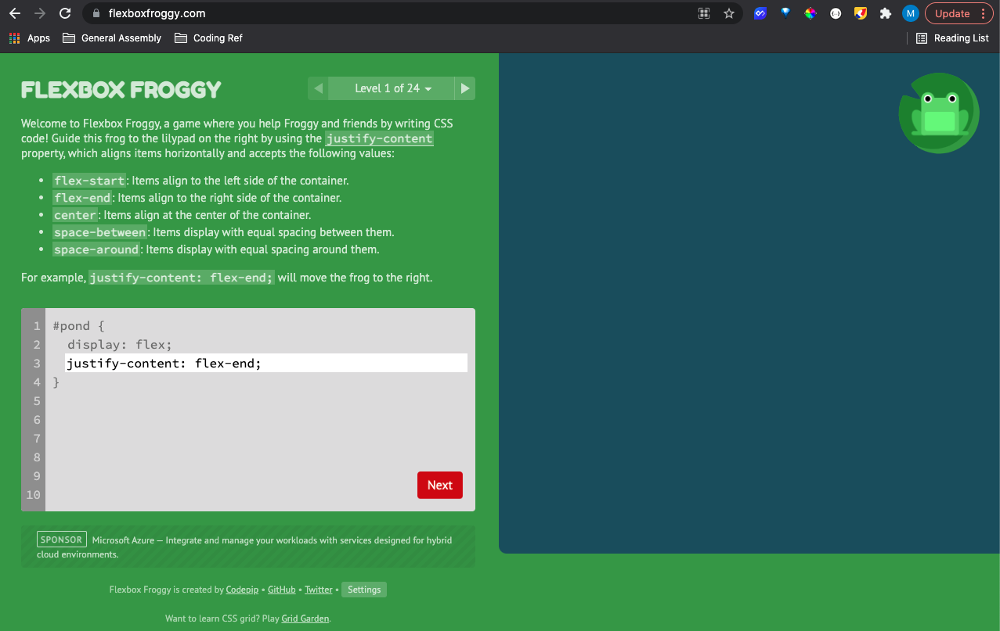

# Flexbox Froggy

For this deliverable go ahead and fork and clone this repo.

Flexbox Froggy is an excellent resource to get up and running with CSS Flexbox.
[Flexbox Froggy](https://flexboxfroggy.com/)

For this assignment make it to at least level 12 and take a screenshot of your progress once complete. Go ahead and move the screenshot image into this repo and submit your pull request.

## Quick screenshots guides:
[Apple's Screenshot Guide Page](https://support.apple.com/en-us/HT201361)

Command key ⌘ + Shift + 4

[Windows' Screenshot Guide Page](https://support.microsoft.com/en-us/windows/how-to-take-and-annotate-screenshots-on-windows-10-ca08e124-cc30-2579-3e55-6db63e36fbb9)

Windows logo key + Shift + S 
